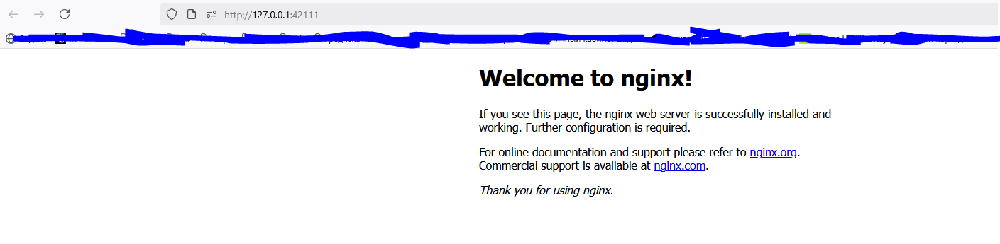
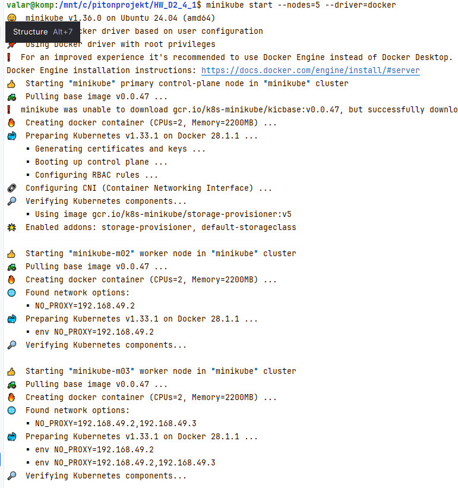
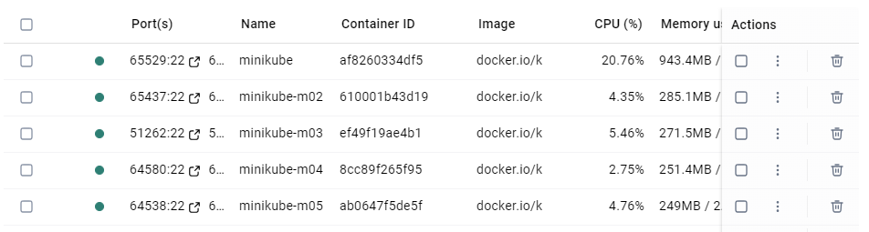
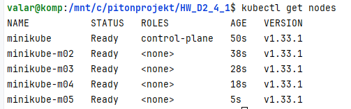

## Задание D3.4

## Запуск миникуба

**wsl minikube**

    version #v1.36.0

**wsl minikube start**

    😄  minikube v1.36.0 on Ubuntu 24.04 (amd64)
    ✨  Automatically selected the docker driver

**wsl kubectl version --client**

    Client Version: v1.29.2
    Kustomize Version: v5.0.4-0.20230601165947-6ce0bf390ce3

**wsl kubectl get nodes**

    NAME       STATUS   ROLES           AGE     VERSION
    minikube   Ready    control-plane   3m18s   v1.33.1

## Создать Deployment со свойствами ниже:

        образ — nginx:1.21.1-alpine;
        имя — nginx-sf;
        количество реплик — 3.

**создать deployment.yaml**

    apiVersion: v1
    kind: ConfigMap
    metadata:
      name: nginx-conf
      namespace: default
    data:
      nginx.conf: |
        user nginx;
        worker_processes  1;
        events {
          worker_connections  10240;
        }
        http {
          server {
            listen       80;
            server_name  localhost;
            location / {
              root   /usr/share/nginx/html;
              index  index.html index.htm;
            }
          }
        }

**Применение манифеста**

    wsl kubectl apply -f deployment.yaml
        deployment.apps/nginx-sf created

**Проверка**

    статус Deployment-а:
    wsl kubectl get deployments
        NAME       READY   UP-TO-DATE   AVAILABLE   AGE
        nginx-sf   3/3     3            3           86s
    Также можно посмотреть Pod-ы:
    wsl kubectl get pods
        NAME                        READY   STATUS    RESTARTS   AGE
        nginx-sf-56499c7987-2jqhk   1/1     Running   0          100s
        nginx-sf-56499c7987-6xgkl   1/1     Running   0          100s
        nginx-sf-56499c7987-zp9zq   1/1     Running   0          100s

## Создание ConfigMap-а
    путь до файла в Pod-е — /etc/nginx/nginx.conf;
    содержимое файла:

        user nginx;
        worker_processes  1;
        events {
          worker_connections  10240;
        }
        http {
          server {
              listen       80;
              server_name  localhost;
              location / {
                root   /usr/share/nginx/html;
                index  index.html index.htm;
            }
          }
        }

**ConfigMap**

    ConfigMap — это объект Kubernetes, 
    который позволяет хранить нечувствительные 
    к безопасности данные конфигурации (например, .conf файлы). 

    1. wsl kubectl create configmap nginx-conf --from-file=nginx/nginx.conf
    2. wsl kubectl apply -f nginx/nginx-configmap.yaml
        configmap/nginx-conf created

**Обновление Deployment для монтирования ConfigMap**

    Теперь нужно обновить ваш deployment.yaml, чтобы он монтировал файл nginx.conf из ConfigMap 
    в нужное место внутри контейнера: /etc/nginx/nginx.conf. 

    Добавим секции volumes и volumeMounts

**Примените изменения**

    wsl kubectl apply -f deployment.yaml
        deployment.apps/nginx-sf configured

**Проверка**

    wsl kubectl get pods
        NAME                        READY   STATUS    RESTARTS   AGE
        nginx-sf-745748454c-clsfr   1/1     Running   0          43s
        nginx-sf-745748454c-mg9b4   1/1     Running   0          44s
        nginx-sf-745748454c-r9b8p   1/1     Running   0          42s

    Чтобы убедиться, что файл подключен правильно, можно зайти внутрь одного из Pod-ов
        wsl kubectl exec -it <pod-name> -- sh
        cat /etc/nginx/nginx.conf

## Создать service для того, чтобы можно было обращаться к любому из Pod-ов по единому имени:

        имя сервиса sf-webserver;
        внешний порт — 80.

**Что такое Service?**

    Service  — это объект Kubernetes, который предоставляет стабильный IP-адрес и DNS-имя  для набора Pod-ов. 
    Он также обеспечивает балансировку нагрузки  между репликами (Pod’ами). 

**service.yaml**

    apiVersion: v1
    kind: Service
    metadata:
      name: sf-webserver
    spec:
      selector:
        app: nginx-sf
      ports:
        - protocol: TCP
          port: 80
          targetPort: 80
    
**Применение**

    wsl kubectl apply -f service.yaml
        service/sf-webserver created

**Проверка**

    wsl kubectl get services
        NAME           TYPE        CLUSTER-IP     EXTERNAL-IP   PORT(S)   AGE
        kubernetes     ClusterIP   10.96.0.1      <none>        443/TCP   137m
        sf-webserver   ClusterIP   10.103.39.19   <none>        80/TCP    24s

    kubernetes — это встроенный системный сервис, который всегда создаётся в кластере Kubernetes-а.
    Он указывает на API-сервер Kubernetes-а и доступен по адресу https://kubernetes.default.svc.cluster.local
    Подключение к API: 
        wsl kubectl cluster-info
    Можно выполнить GET-запрос к API через kubectl
        wsl kubectl get --raw /api/v1/namespaces
    Но тип ClusterIP означает, что он доступен только внутри кластера
    Чтобы открыть его в браузере на Windows: 
    Вариант 1: 
        Использовать kubectl port-forward (powershell)
            wsl kubectl port-forward service/sf-webserver 8080:80
        Теперь открой в браузере:
            http://localhost:8080
    Вариант 2: 
        Изменить тип сервиса на NodePort
        Выполни:
            wsl kubectl edit service sf-webserver
        Измени строку в yaml-е:
            type: ClusterIP
            на:
            type: NodePort
        Сохрани изменения и получи внешний порт:
            wsl kubectl get service sf-webserver
        Должно быть что-то вроде:
            sf-webserver   NodePort   10.103.39.19   <none>        80:31234/TCP   2m
        Теперь открой:
            http://<IP_адрес_minikube>:31234
        Получи IP Minikube:
            wsl minikube ip

**Как получить внешний доступ (если нужно)?**

    Если вы хотите открыть доступ извне (например, с хост-машины Windows), 
    можно воспользоваться minikube service:
        wsl minikube service sf-webserver
    Minikube автоматически откроет браузер или покажет URL для доступа. 

## Создать секрет со следующими данными:

        имя секрета — auth-basic;
        ключ объекта в секрете — user1;
        значение объекта в секрете user1 — password1;

**Через команду kubectl create secret**

    wsl kubectl create secret generic auth-basic --from-literal=user1=password1
    wsl kubectl create secret generic auth-basic --from-literal=username.txt=user1 --from-literal=password.txt=password1
    wsl kubectl create secret generic auth-basic --from-file=./secret/username.txt --from-file=./secret/password.txt
    wsl kubectl create secret generic auth-basic --from-file=./secret/

**Через манифест**

    кодируем наши данные самостоятельно и после этого добавляем в манифест
    Кодируем наши данные в консоли:
        echo -n 'admin' | base64 
        YWRtaW4=

        echo -n 'B7wItYlHeRR1' | base64
        Qjd3SXRZbEhlUlIx

    Создаем манифест и добавляем туда полученные данные:

    apiVersion: v1
    kind: Secret
    metadata:
      name: db-user-pass
    type: Opaque
    data:
      username: dXNlcjE=
      password: cGFzc3dvcmQx

    wsl kubectl apply -f auth-secret.yaml

**Через htpasswd (для nginx-а)**

    $ htpasswd -c auth user1
    New password: <password1>
    New password:
    Re-type new password:
    Adding password for user user1

    wsl kubectl create secret generic auth-basic --from-file=auth

**Проверка**

    wsl kubectl get secrets
        NAME           TYPE     DATA   AGE
        auth-basic     Opaque   1      5s
    в Base64:
    wsl kubectl get secret auth-basic -o yaml
    https://www.base64decode.org/
    wsl kubectl describe secret auth-basic

**Удалить секрет**

    wsl kubectl delete secret <имя-секрета>
    wsl kubectl delete secret auth-basic
 
## Подключить в наш контейнер эти секреты.
    Обновить конфиг nginx таким образом, 
    чтобы подключенные секреты использовались 
    для авторизации для доступа к странице по умолчанию в nginx.

**Документация**

https://davy.page/nginx-bug

    В auth_basic_user_file нужно указать путь до файла, 
    в котором будут указаны учетные данные для доступа. 
    Файл должен быть создан при помощи утилиты htpasswd от Apache. 
Подробнее о htpasswd-е: https://kubernetes.github.io/ingress-nginx/examples/auth/basic/

    установить apache2-utils:
        wsl sudo apt update
        wsl sudo apt install apache2-utils

    Create htpasswd file
        $ htpasswd -c auth user1
        New password: <password1>
        New password:
        Re-type new password:
        Adding password for user user1

    Convert htpasswd into a secret

        $ kubectl create secret generic basic-auth --from-file=auth
        secret "basic-auth" created

    Examine secret
        $ kubectl get secret basic-auth -o yaml
        apiVersion: v1
        data:
          auth: Zm9vOiRhcHIxJE9GRzNYeWJwJGNrTDBGSERBa29YWUlsSDkuY3lzVDAK
        kind: Secret
        metadata:
          name: basic-auth
          namespace: default
        type: Opaque

    Разбор команды htpasswd -c auth foo по частям:
        htpasswd — это утилита для управления файлами, 
                   содержащими пользователей и их пароли 
                   (обычно для HTTP-аутентификации, например, в Apache).
        -c — флаг, который указывает, что нужно создать новый файл 
             (в данном случае с именем auth). 
             Важно:  если файл уже существует, он будет перезаписан.
        auth — имя файла, в котором будут храниться логины и захэшированные пароли 
               (может быть любым, часто называют .htpasswd).
        foo — имя пользователя , для которого вы хотите создать запись.
     

**Обновить конфиг Nginx для Basic Auth**

    location / {
        auth_basic "Restricted";
        auth_basic_user_file /etc/nginx/.htpasswd;
        ...
    }
        Включает Basic Auth. Текст в кавычках будет отображаться в окне ввода логина/пароля.
        auth_basic "Restricted";
        Указывает путь к файлу с учетными данными (он подключен через Secret).
        auth_basic_user_file /etc/nginx/.htpasswd; 

**Как подключить Secret к контейнеру**

    1. Как файл  (используется для .htpasswd, TLS-сертификатов и т.д.)
    2. Как переменная окружения  (например, для API ключей)
     
**Deployment с подключением Secret и Basic Auth**

    apiVersion: apps/v1
    kind: Deployment
    metadata:
      name: nginx-sf
    spec:
      replicas: 3
      selector:
        matchLabels:
          app: nginx-sf
      template:
        metadata:
          labels:
            app: nginx-sf
        spec:
          containers:
          - name: nginx
            image: nginx:1.21.1-alpine
            ports:
            - containerPort: 80
            volumeMounts: — в описании контейнера добавляем блок с описанием хранилищ, которые мы хотим примонтировать
            - name: config-volume — имя хранилища
              mountPath: /etc/nginx/nginx.conf — путь, куда монтируем данные
              subPath: nginx.conf
            - name: auth-secret
              mountPath: /etc/nginx/.htpasswd
              subPath: .htpasswd
              readOnly: true — добавляем флаг, который говорит, что данные доступны только для чтения
          volumes: — в этом блоке объявляем хранилища, которые можем использовать в контейнерах
          - name: config-volume — имя хранилища, на которое будем ссылать в конфигах контейнера
            configMap: — тип источника данных
              name: nginx-conf
          - name: auth-secret
            secret:
              secretName: auth-basic — имя секрета

**Применить**

    wsl kubectl apply -f nginx/nginx-configmap.yaml
        configmap/nginx-conf configured
    wsl kubectl apply -f deployment.yaml
        deployment.apps/nginx-sf configured

**Проверка**

    wsl minikube service sf-webserver --url
        😿  service default/sf-webserver has no node port
        ❗  Services [default/sf-webserver] have type "ClusterIP" not meant to be exposed, however for local development minikube allows you to access this !
        http://127.0.0.1:33385
        ❗  Because you are using a Docker driver on linux, the terminal needs to be open to run it.

    Скопируйте URL и откройте его в браузере — вы должны увидеть окно Basic Auth.
    Используйте:
        Логин : user1
        Пароль : password1

    wsl kubectl get pods
    wsl kubectl exec -it <pod-name> -- sh
    wsl kubectl exec -it nginx-sf-6b5cdfcd7b-pg2dj -- sh
    cat /etc/nginx/auth/.htpasswd
    cat /etc/nginx/nginx.conf
    ls -la /etc/nginx/auth/

    wsl kubectl describe pod nginx-sf-7777b9974b-s658r
    wsl kubectl logs nginx-sf-5bdcf7699f-8scpq

**После любого изменения в ConfigMap или Secret**

    wsl kubectl rollout restart deployment nginx-sf
    wsl kubectl delete pod -l app=nginx-sf

## Задание D2.4.1

  
<strong>Поднимите у себя локальный K8S-кластер с помощью Minikube.</strong>

        curl -Lo minikube https://storage.googleapis.com/minikube/releases/latest/minikube-linux-amd64
        chmod +x minikube
        sudo mv minikube /usr/local/bin/  

  
<strong>В кластере должно быть всего пять нод, одна из них должна быть Сontrol Plane-нода</strong>

        minikube start --nodes=5 --driver=docker

  
<strong>После того как ноды поднимутся, получите список всех нод в вашем локальном кластере</strong>

        kubectl get nodes

  
<strong>Все команды и вывод результатов выполнения этих команд отправьте ментору на проверку</strong>

## Задание D2.4.2

  
<strong>Описание:</strong>

    Сообщество Kubernetes объявило, что в конце 2021 года Docker в качестве среды выполнения контейнеров 
    будет объявлен как устаревший и не будет использоваться в K8S-кластере. 
    Но Kind, который поднимает K8S-кластер на Docker, говорит о том, 
    что в отношении поддержки работы кластера K8S беспокоиться не стоит.

  
<strong>Задание:</strong>

    Почему Kind говорит, что это изменение его не затронет?

  
<strong>Ответ:</strong>

    Сообщество Kubernetes действительно объявило, что Docker в качестве среды выполнения контейнеров 
    будет объявлен устаревшим к концу 2021 года 

    Это связано с тем, что Docker не является CRI-совместимым (Container Runtime Interface), 
    и для его использования внутри K8s-кластера требуется специальный шим — Dockershim. 
    Удаление Dockershim из Kubelet означает, что Docker больше не может быть использован 
    как runtime в K8s без дополнительных инструментов. 

    Однако kind  (Kubernetes IN Docker) говорит, что это изменение его не затронет, 
    потому что он использует Docker не как контейнерный runtime для узлов кластера , 
    а как средство для запуска контейнеров, представляющих узлы самого кластера . То есть: 

    kind создает локальный K8s-кластер, где каждый узел — это отдельный контейнер Docker ;
    внутри этих контейнеров kind использует уже CRI-совместимые runtimes , 
    такие как containerd или CRI-O, которые и управляют контейнерами приложений 

    Таким образом, даже после удаления поддержки Docker как контейнерного рантайма в K8s, 
    kind продолжает использовать Docker только на уровне хоста для создания и управления узлами-контейнерами , 
    но не для запуска контейнеров внутри кластера. Это делает изменения в K8s невлияющими на работоспособность kind. 

    Кроме того, kind официально заявляет, что поддерживает сборку и запуск кластеров из исходников Kubernetes, 
    а также совместим с Linux, macOS и Windows, что усиливает его гибкость и надежность 
    вне зависимости от изменений в основной кодовой базе Kubernetes

    Поэтому в отношении поддержки работы кластера K8S с помощью kind беспокоиться не стоит : 
    он не зависит от внутренней политики K8s по отношению к Docker как рантайму, 
    так как использует Docker лишь как платформу для запуска системных контейнеров, 
    а не как исполнительную среду для рабочих нагрузок кластера. 

  
<strong>Runtime (среда выполнения )</strong>

    Runtime  (или среда выполнения ) — это вычислительное окружение, 
    необходимое для запуска компьютерной программы и доступное во время её выполнения. 
    Оно обеспечивает выполнение кода, управляет ресурсами, предоставляет библиотеки и 
    инструменты для работы приложения 

    Например, runtime может включать в себя:
        Менеджер памяти;
        Средства управления типами данных;
        Библиотеки, реализующие системные вызовы и стандартные функции;
        Поддержку многопоточности и обработки исключений.

    Также runtime можно рассматривать как слой абстракции между операционной системью и приложением, 
    который позволяет программе работать на виртуальной или вымышленной машине 

    Часто термин используется в контексте фреймворков и платформ, 
    например, .NET Runtime — это среда, которая выполняет код и 
    управляет классами приложений, созданных на основе .NET 

    В программировании также упоминаются runtime-компоненты  — это элементы, 
    которые обеспечивают выполнение программы непосредственно во время её запуска 

    Таким образом, runtime — это совокупность механизмов и компонентов, 
    без которых невозможно запустить и выполнить программу. 

## Установка Minikube

  
<strong>Скачиваем</strong>

    curl -Lo minikube https://storage.googleapis.com/minikube/releases/latest/minikube-linux-amd64
    curl -Lo minikube https://github.com/kubernetes/minikube/releases/latest/download/minikube-linux-amd64 

  
<strong>Делаем исполняемым</strong>

    chmod +x minikube

  
<strong>Перемещаем файл</strong>

    sudo mv minikube /usr/local/bin/

  
<strong>После установки проверь</strong>

    which minikube
    Должно вернуть: /usr/local/bin/minikube
    minikube version

  
<strong>сброс пароля</strong>

    passwd

## Запустите Minikube 

  
<strong>Используя Docker-драйвер (рекомендуется) </strong>

    minikube start --driver=docker
    minikube start --nodes=5 --driver=docker
    💡 Предупреждение:
    ❗ /usr/local/bin/kubectl is version 1.29.2, which may have incompatibilities with Kubernetes 1.33.1.
    ▪ Want kubectl v1.33.1? Try 'minikube kubectl -- get pods -A'

    Это важное замечание:
    Версия установленного у тебя kubectl (v1.29 ) немного младше версии Kubernetes в кластере (v1.33 ).
    В большинстве случаев это не критично, но если ты хочешь использовать совместимую версию kubectl , 
    используй команду:
        minikube kubectl -- get pods -A
    Либо установи более свежий kubectl отдельно, чтобы он соответствовал версии кластера. 

  
<strong>Проверка состояния кластера</strong>

    kubectl get nodes
    Ожидаемый вывод:
        NAME       STATUS   ROLES           AGE   VERSION
        minikube   Ready    control-plane   XXs   v1.33.1

    И проверь системные поды:
    kubectl get pods -A

    Должны быть такие компоненты:
    kube-system → coredns, etcd, kube-apiserver, kube-controller-manager, kube-proxy, kube-scheduler
    kube-node-lease → информация о доступности нод
    default → storage-provisioner
     

## Как дальше использовать Minikube

  
<strong>Запуск собственных приложений</strong>

  - **Например, запусти простое демо-приложение:**

        kubectl create deployment hello-minikube --image=k8s.gcr.io/echoserver:1.4

  - **И открой его во внешнем доступе:**

        kubectl expose deployment hello-minikube --type=NodePort --port=8080

  - **Посмотри URL:**

        minikube service hello-minikube --url

  - **Или просто открой в браузере:**

        minikube service hello-minikube

  
<strong>Остановка и удаление кластера</strong>

  - **Если нужно остановить кластер:**

        minikube stop

  - **Если нужно полностью удалить кластер:**

        minikube delete
        minikube delete --all

  
<strong>Полезные команды</strong>

  - **Показывает текущее состояние кластера**

        minikube status
	
  - **Информация о кластере**

        kubectl cluster-info
	
  - **Показать все ресурсы**

        kubectl get all --all-namespaces
	
  - **Открыть веб-интерфейс Kubernetes**

        minikube dashboard
	
  - **Показать IP-адрес Minikube**

        minikube ip

  
<strong>Полезные команды для проверки </strong>

  - **Посмотреть все namespaces**

        kubectl get namespaces

  - **Посмотреть все ресурсы во всех namespaces**

        kubectl get all --all-namespaces

  - **Посмотреть объекты Lease в kube-node-lease**
  - 
        kubectl get leases -n kube-node-lease

  - **Посмотреть поды в default (если есть)**

        kubectl get pods -n default

## Дополнительно

  
<strong>Dashboard Kubernetes</strong>

 - **Запустите панель управления**   

        minikube dashboard
        Она автоматически откроет браузер с веб-интерфейсом
        http://127.0.0.1:37913/api/v1/namespaces/kubernetes-dashboard/services/http:kubernetes-dashboard:/proxy/
 - **получить URL**    

        minikube dashboard --url

  
<strong></strong>

 
 
 

